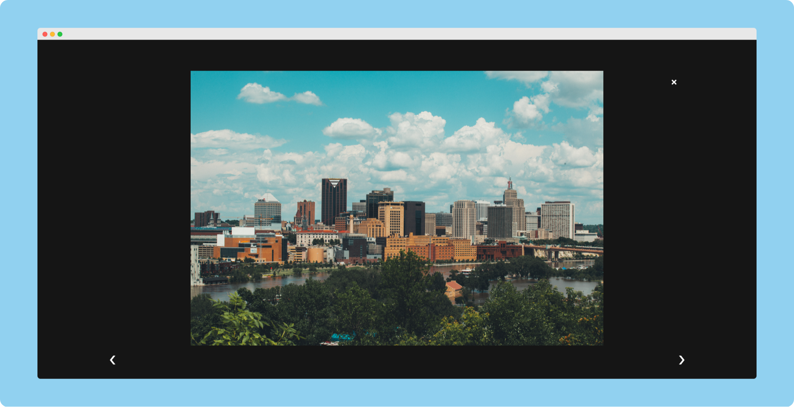

# [Photo Gallery React App](https://praashoo7.github.io/Photo-Gallery-React/)




## Setup
- Clone it!
```sh
git clone https://github.com/Praashoo7/Photo-Gallery-React.git
cd Photo-Gallery-React
```
- Install Dependencies :
```sh
npm install
```
- Start a local Web Server by running :
```sh
npm start
```

## License

Photo Gallery React App is open-source Software Licensed under the [MIT License](https://github.com/Praashoo7/Photo-Gallery-React/blob/main/LICENSE)
