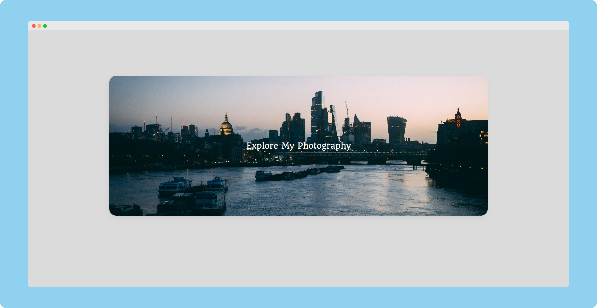

# [Photo Gallery React App](https://praashoo7.github.io/Photo-Gallery-React/)




## PageSpeed Insights

- Mobile

    
  - [Check Out PageSpeed Insights [Mobile]](https://pagespeed.web.dev/analysis/https-praashoo7-github-io-Photo-Gallery-React/vfhn8f04ee?form_factor=mobile)
  - [Check Out Lighthouse Report [Mobile]](https://htmlpreview.github.io/?https://github.com/Praashoo7/Photo-Gallery-React/blob/main/public/ReadMe-Files/praashoo7.github.io-20240220T005615.html)<br><br>


- Desktop

    
  - [Check Out PageSpeed Insights [Desktop]](https://pagespeed.web.dev/analysis/https-praashoo7-github-io-Photo-Gallery-React/vfhn8f04ee?form_factor=desktop)
  - [Check Out Lighthouse Report [Desktop]](https://htmlpreview.github.io/?https://github.com/Praashoo7/Photo-Gallery-React/blob/main/public/ReadMe-Files/praashoo7.github.io-20240220T005637.html)<br><br>


## Setup
- Clone it!
```sh
git clone https://github.com/Praashoo7/Photo-Gallery-React.git
cd Photo-Gallery-React
```
- Install Dependencies :
```sh
npm install
```
- Start a local Web Server by running :
```sh
npm start
```

## Credits

Images from [Unsplash](https://unsplash.com/)

## License

Photo Gallery React App is open-source Software Licensed under the [MIT License](https://github.com/Praashoo7/Photo-Gallery-React/blob/main/LICENSE)
